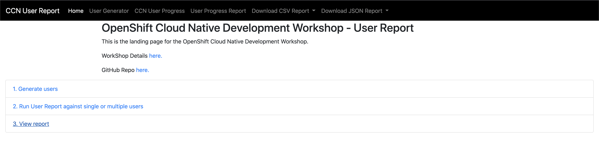

# CCN User Report 

## Local Deployment 

### Build and Push this as an Image

A *scripts/* directory includes *build* and *push* scripts to create a build
using the docker CLI, and push it to [quay.io](https;//quay.io).


Sample usage:

```bash
# This can take a while depending on your connection speed and machine specs
TAG=v0.0.8 ./scripts/image.build.sh 

# Pushes the image to quay.io for the specified user.
# This is bound by your upload speed...so be patient ☕
QUAY_USER=your-username TAG=v0.0.8 ./scripts/image.push.sh
```

### Run image locally 
```
docker run -d -p 5000:5000 --name ccn-user-report ccn-user-report:v0.0.8
```

### Local deployment

**1. Generate Users**  
Open Web browser and navigate to url. 

```
localhost:5000/user_generator
```

**2. Check user Progress**  
```
http://localhost:5000/user_progress
```

**3. Check user Report**  
```
http://localhost:5000/print_user_report
```

**4. Download CSV file via cli**  
```
curl -o my_report.csv --location --request GET 'http://localhost:5000/export_csv/module1'
```

**5. Download JSON file via cli**  
```
curl -o my_report.json --location --request GET 'http://localhost:5000/export_json/module1'
```

## Deploy using OC CLI  
```
oc login
oc new-project ccn-user-report
```

### Populate OpenShift Endpoint  
```
OPENSHIFT_ENDPOINT="cluster-4ac8.cluster-4ac8.sandbox1288.opentlc.com"
sed -i -e "s/ocp4.example.com/${OPENSHIFT_ENDPOINT}/" openshift/project.yml  
```
### Populate OpenShift UserName  
```
OPENSHIFT_USERNAME="myuser"
sed -i -e "s/changeuser/${OPENSHIFT_USERNAME}/" openshift/project.yml  
```
### Populate OpenShift password  
```
POPULATE_OPENSHIFT_PASSWORD="0123456789"
sed -i -e "s/changepassword/${POPULATE_OPENSHIFT_PASSWORD}/" openshift/project.yml  
```

### Deploy CCN User Report  
```
oc create -f openshift/project.yml  
```

## How to Use  


**Export route**  
```
export URL_ENDPOINT=$(oc get route | grep user-report | awk '{print $2}')
```

**1. Generate Users**  
Open Web browser and navigate to url. 
```
echo http://$URL_ENDPOINT/user_generator
```

**2. Check user Progress**  
```
echo http://$URL_ENDPOINT/user_progress
```

**3. Check user Report**  
```
echo http://$URL_ENDPOINT/print_user_report
```

**4. Download CSV file via cli** 
```
curl -o my_report.csv --location --request GET 'http://$URL_ENDPOINT/export_csv/module1'
```

**5. Download JSON file via cli** 
```
curl -o my_report.json --location --request GET 'http://$URL_ENDPOINT/export_json/module1'
```
